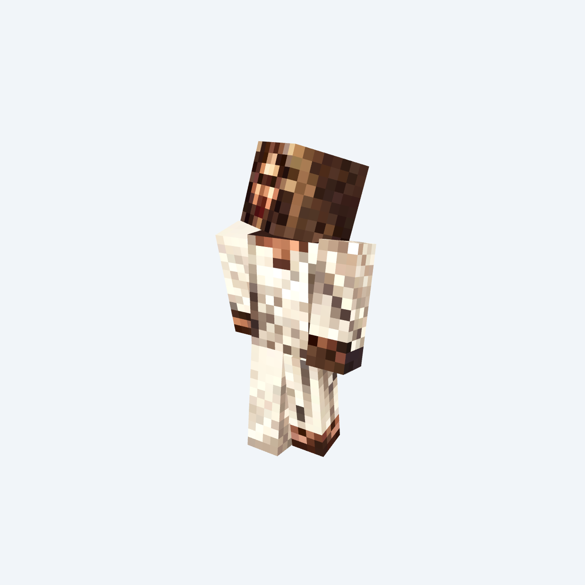

# mcskins-gen

Generate Minecraft skins from text prompts using [Nano Banana Pro](https://replicate.com/google/nano-banana-pro) on Replicate. Provide a description, and the tool produces a ready-to-use 64x64 skin PNG with transparent background.


*Example output for the prompt "Jesus Christ".*

## Setup

Requires Python 3.13+ and [uv](https://docs.astral.sh/uv/).

```bash
uv sync
```

Create a `.env` file with your [Replicate API token](https://replicate.com/account/api-tokens):

```
REPLICATE_API_TOKEN=your_token_here
```

## Usage

```bash
# Pass a prompt directly
python main.py "Batman"

# Or run interactively
python main.py
```

You'll be asked to pick an overlay mode:

1. **No overlays** — base skin only
2. **Head only** — keeps the hat layer
3. **All overlays** — keeps all overlay layers

## Output

| Directory    | Contents                                      |
|--------------|-----------------------------------------------|
| `skins/`     | Final 64x64 skin PNGs (transparent background)|
| `skins_raw/` | Raw 1024x1024 images from the API             |

Files are named `{timestamp}_{prompt}.png` (e.g. `t8kg3c_Dolphin.png`).

## How it works

1. Three template skins are upscaled to 1024x1024 and placed on a magenta chroma key background.
2. The templates and your prompt are sent to Nano Banana Pro via the Replicate API.
3. The returned 1024x1024 image is saved to `skins_raw/`.
4. The magenta background is removed (made transparent) and the image is downscaled to 64x64 using nearest-neighbor resampling to preserve pixel art.
5. Overlay layers are cleared based on your chosen mode, and the final skin is saved to `skins/`.
